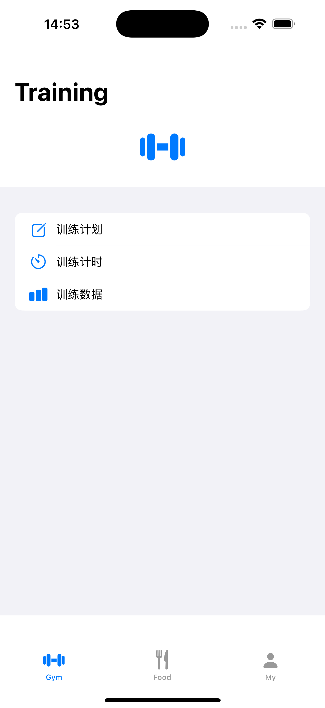
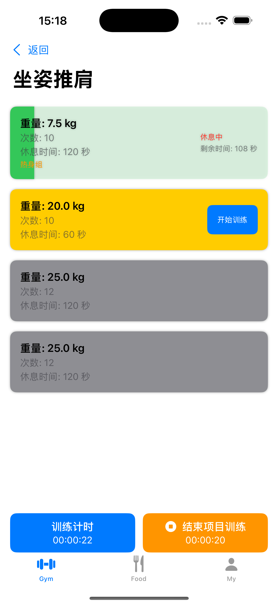

# 🏋️‍♂️ Training Manager

一个专为健身爱好者设计的训练管理 iOS 应用，提供完整的训练计划管理、智能计时和饮食辅助功能。

## ✨ 主要特性

- 📋 **训练计划管理** - 创建和管理个性化的训练计划
- ⏱️ **智能计时系统** - 总时间、项目时间、组时间三重计时功能
- 💪 **训练项目库** - 丰富的训练动作和项目数据库
- 📊 **训练记录追踪** - 详细记录训练数据和进度
- 🍽️ **饮食辅助** - 营养摄入记录和追踪功能
- 📱 **简洁界面** - 现代化的 iOS 设计风格

## 📱 应用截图

<div align="center">
  
  
  
  
  
</div>

## 🚧 开发进度

### ✅ 已完成功能
- 📋 **训练计划管理** - 完整的训练计划创建、编辑和管理功能
- ⏱️ **智能计时系统** - 总时间、项目时间、组时间三重计时功能
- 💪 **训练项目管理** - 训练动作和项目的添加、配置功能
- 📱 **核心界面** - 主页面、训练计划、训练项目、训练组等核心页面

### 🔄 开发中功能
- 📊 **训练记录追踪** - 历史数据记录和统计功能
- 📈 **数据可视化** - 训练进度图表展示
-  🍽️ **饮食辅助模块** - 营养摄入记录和追踪功能

### 📋 计划功能
- 🎯 **目标设定** - 个性化训练目标设置
- 🔔 **提醒功能** - 训练提醒和休息提醒
- ☁️ **数据同步** - iCloud 数据同步功能

## 🛠️ 技术栈

- **开发语言**: Swift
- **UI 框架**: UIKit / SwiftUI
- **数据存储**: Core Data
- **图表组件**: Charts
- **开发环境**: Xcode 15+
- **最低支持**: iOS 15.0+

## 🚀 快速开始

### 环境要求

- macOS 13.0+
- Xcode 15.0+
- iOS 15.0+ 设备或模拟器

### 安装步骤

1. **克隆项目**
   ```bash
   git clone https://github.com/yourusername/Training-Food-Recorder.git
   cd Training-Food-Recorder
   ```

2. **打开项目**
   ```bash
   open HelloIOS.xcodeproj
   ```

3. **运行应用**
   - 选择目标设备或模拟器
   - 按 `Cmd + R` 运行项目

## 📖 使用指南

1. **创建训练计划** - 设置个人训练计划，添加训练项目和组数
2. **开始训练** - 使用三重计时功能进行训练，实时记录每组数据
3. **查看训练记录** - 回顾历史训练数据和进度统计
4. **饮食记录** - 辅助记录每日营养摄入，配合训练目标
5. **数据分析** - 查看训练和饮食的综合数据分析


---

⭐ 
